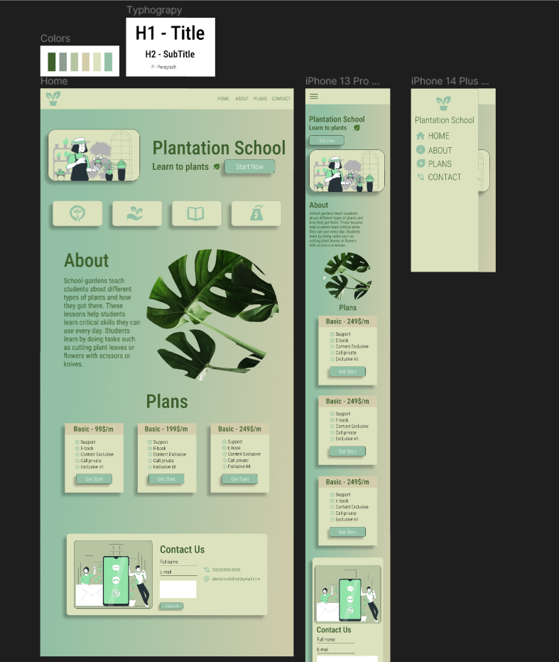

    
    
    

<h1>Plantation School - Website Template</h1>

<h2 align='center'></h2>
 
<h3>Projeto criado com intuito de colocar em código um template que fiz com Figma.</h3>
 

<h2>
    
Used in Project:

    <ul>
        <li>
            
            <a href="https://www.figma.com/"> Figma </a> - Editor gráfico de vetor e prototipagem de projetos de design baseado principalmente no navegador web.
        </li>
         <li>
            
            <a href="https://www.figma.com/"> Figma </a> - Uma ferramenta de desenvolvimento rápido para projetos web modernos .
         </li>
    </ul>
</h2>
 

<h2><strong> > </strong>
    <a href="https://www.figma.com/file/uprGSzOxwk8S5qt5gsA1BR/Plantation-School?node-id=0%3A1">🎨 Figma template</a>
</h2>
 

  

    <h2 align="center">🎨 Preview from App:</h2>
      
    

 

    <h2 align="center">🎨 Preview from Mobile:</h2>
    

  
<h1>Author</h1>

 
<b>Danilo Gomes</b></a>

Feito com ❤️ por Danilo Gomes 👋🏽 Entre em contato!

